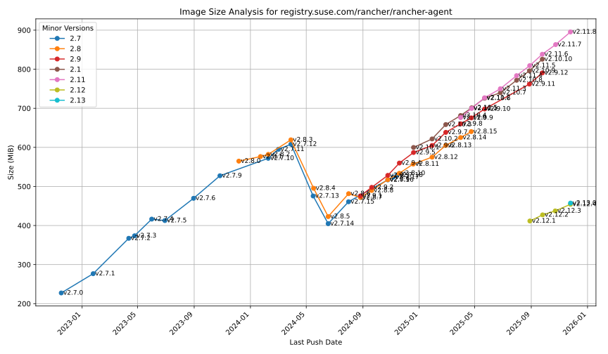
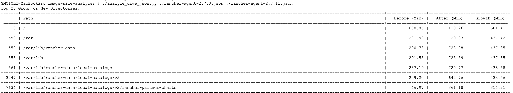

# Image Size Analysis Toolkit

This repository contains a collection of tools for analyzing and visualizing the size of container images.

---

## Table of Contents

- [image-size-analyzer (Go)](#image-size-analyzer-go)
- [plot.py (Python)](#plotpy-python)
- [analyze_dive_json.py (Python)](#analyze_dive_jsonpy-python)

---

## image-size-analyzer (Go)

This is the primary Go application for analyzing the size history of a container image from a registry. It fetches all tags for a given image, retrieves their size and creation date, and outputs the data into a CSV file, which can then be used for visualization.

### Usage

To run the analyzer, use the `go run` command, providing necessary flags.
This will produce a CSV file with tabular data and an SVG chart.

```bash
go run ./cmd/image-size-analyzer --image <image-name>
```


**Example:**

[rancher_rancher-agent_linux_amd64.csv](rancher_rancher-agent_linux_amd64.csv)


### Flags

*   `--image` (required): OCI image to analyze (e.g., `golang`).
*   `--registry`: Registry to use (default: `gcr.io`).
*   `--csv`: Generate CSV output (default: `true`).
*   `--os`: Operating system for the image (default: `linux`).
*   `--arch`: Architecture for the image (default: `amd64`).
*   `--tag-regex`: Regex to filter tags (default: `.*` which matches all tags).


## plot.py (Python)

This Python script takes a CSV file generated by the `image-size-analyzer` and creates a plot visualizing the size of different image versions over time. The script is self-contained and manages its dependencies using `uv`.

### Usage

Execute the script, providing the path to the CSV file as an argument. By default, the script will save the plot as an SVG file (e.g., `alpine_linux_amd64.svg`).

```bash
./plot.py <path-to-your-csv-file.csv>
```

**Example:**




### Flags

To display the plot in an interactive window instead of saving it to a file, use the `--interactive` flag.

```bash
./plot.py <path-to-your-csv-file.csv> --interactive
```

---

## analyze_dive_json.py (Python)

This script is used to analyze and compare the filesystems of two container images based on JSON reports generated by the tool [Dive](https://github.com/wagoodman/dive). It's particularly useful for identifying which directories have grown, shrunk, or been added/removed between two image versions.

### Usage

You must first generate JSON reports for the images you want to compare using `dive`.

```bash
# Generate a report for the "before" image
dive your-image:before-tag --json before.json

# Generate a report for the "after" image
dive your-image:after-tag --json after.json
```

Once you have two JSON reports, you can compare them by running the script. It will output two tables: one for the directories that have grown the most (or are new) and one for the directories that have shrunk the most (or were removed).

```bash
# Compare the two JSON files
./analyze_dive_json.py before.json after.json
```

**Example:**


### Flags

By default, the script shows the top 20 directories in each category. You can change this number with the `--limit` flag.

```bash
# Show the top 10 changes
./analyze_dive_json.py before.json after.json --limit 10
```
